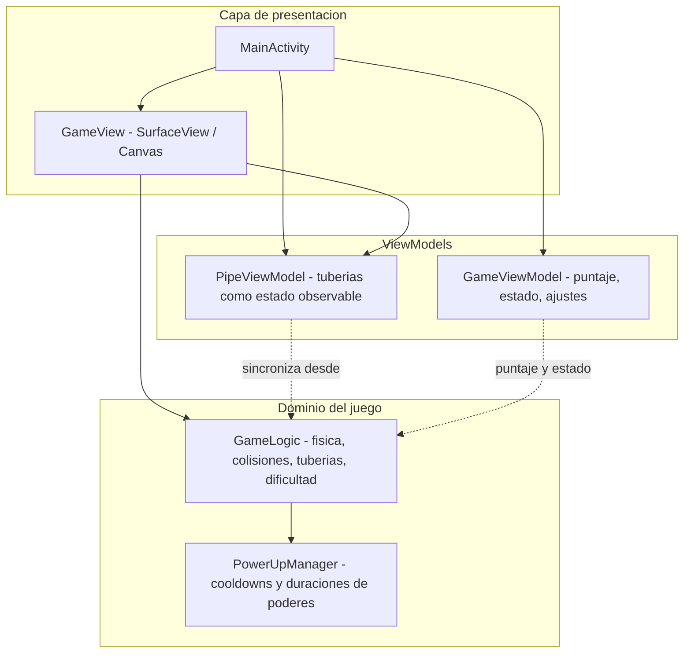

# Pajarito Saltador

Juego arcade para Android inspirado en el salto entre tuberías: controlas un pájaro, esquivas obstáculos, sumas puntos y usas poderes con tiempos de reutilización (cooldown) gestionados de forma centralizada. Está pensado para pantallas en vertical, con física y geometría adaptadas al tamaño real del dispositivo para que la experiencia sea coherente en distintos móviles.

---

## Por qué en GitHub no aparece una «Release» al hacer push

**Subir commits no crea automáticamente una Release.** GitHub muestra la pestaña **Releases** solo cuando publicas explícitamente una versión: un **tag** (por ejemplo `v1.0.0`) y, opcionalmente, **notas** y **archivos adjuntos** (por ejemplo el APK).

La carpeta `releases/` de este repositorio es solo una **ruta en el código** donde se versiona el archivo `pajarito-saltador-1.0.0-release.apk`. Eso **no** sustituye al producto «GitHub Release».

### Crear una Release en GitHub (recomendado)

1. Entra al repositorio en GitHub.
2. **Releases** → **Draft a new release** (o **Create a new release**).
3. Elige o crea un tag, por ejemplo `v1.0.0`, apuntando a la rama deseada (p. ej. `master`).
4. Título: p. ej. `v1.0.0 - Primera release pública`.
5. Describe cambios en el cuerpo (notas de la versión).
6. En **Attach binaries**, arrastra el APK (puedes usar el mismo que está en `releases/` o uno nuevo compilado).
7. Publica (**Publish release**).

Así la release aparece en la página del repo y los visitantes pueden descargar el APK desde GitHub sin clonar el repositorio.

### Opción por línea de comandos (GitHub CLI)

Si tienes [`gh`](https://cli.github.com/) instalado y autenticado:

```bash
gh release create v1.0.0 releases/pajarito-saltador-1.0.0-release.apk --title "v1.0.0" --notes "Primera release firmada para pruebas."
```

Ajusta la ruta del APK y el tag según tu versión.

---

## Arquitectura

El proyecto sigue una separación clara entre **lógica de juego**, **estado observable para la UI** y **renderizado**, alineada con **MVVM** y buenas prácticas de Android.



- **`GameLogic`**: núcleo del bucle de juego: pájaro, tuberías, coleccionables, estados (`START`, `PLAYING`, `PAUSED`, `GAME_OVER`), física y colisiones. Las magnitudes se basan en **fracciones del ancho y alto del viewport** para mantener proporciones entre dispositivos.
- **`PowerUpManager`**: concentra la gestión de **enfriamientos** y **duraciones** de los poderes, desacoplada del resto de la lógica.
- **`GameViewModel`**: estado que interesa a la interfaz (puntaje, récord, música/SFX, estado global del juego) y persistencia del récord y preferencias vía **SharedPreferences**.
- **`PipeViewModel`**: expone la lista de tuberías como flujo observable (`StateFlow`) para MVVM; la lógica de movimiento sigue en `GameLogic`.
- **`GameView`**: `SurfaceView` con renderizado en **Canvas**, hilo de juego dedicado y viewport virtual escalable a la pantalla.

La música de fondo se sirve mediante un **`Service`** (`MusicService`), manteniendo la reproducción desacoplada del ciclo de vida inmediato de la vista.

---

## Stack tecnológico

| Área | Tecnología |
|------|------------|
| Lenguaje | Kotlin |
| UI del contenedor | AndroidX, layouts XML, `AppCompatActivity` |
| Juego | `SurfaceView`, `Canvas`, bucle en hilo propio |
| Arquitectura | MVVM (`ViewModel`, `LiveData`, `StateFlow` donde aplica) |
| Build | Gradle 8.13, Android Gradle Plugin, Kotlin JVM 17 |
| Pruebas | JUnit, pruebas sobre `GameLogic` |

`Jetpack Compose` está en el árbol de dependencias para composición futura o tooling; la pantalla principal del juego está construida con vistas clásicas y `GameView`.

---

## Requisitos para compilar

- **Android Studio** reciente (recomendado) o JDK 17 y **Android SDK** (API 34 para compilar; **minSdk 24**).
- Archivo `local.properties` con `sdk.dir=...` (lo genera Android Studio).

### Compilar debug

```bash
./gradlew assembleDebug
```

En Windows: `gradlew.bat assembleDebug`

### Compilar release firmada

1. Copia `keystore.properties.example` a `keystore.properties` en la raíz del proyecto y rellena rutas y contraseñas del keystore (el archivo **no** debe subirse al repositorio).
2. Coloca el archivo `.jks` en la ruta indicada (tampoco versionado).

```bash
./gradlew assembleRelease
```

La APK generada suele quedar en `app/build/outputs/apk/release/`. Para compartir builds estables, puedes copiar el artefacto a `releases/` con un nombre versionado y documentar el cambio en una **GitHub Release** como se indicó arriba.

---

## Estructura relevante

- `app/src/main/java/com/pajaritosaltador/game/` — código del juego (lógica, vistas, ViewModels, servicio de música).
- `app/src/test/` — pruebas unitarias de la lógica.
- `releases/` — APK de distribución opcional versionada en el repo (no sustituye a GitHub Releases).

---

## Versión actual

- **versionName:** 1.0.0  
- **applicationId:** `com.pajaritosaltador.game`

---

## Licencia

Este proyecto se publica bajo la **Licencia MIT**. El texto legal completo está en el archivo [`LICENSE`](LICENSE) en la raíz del repositorio.

En resumen: puedes usar, copiar, modificar, fusionar, publicar, distribuir, sublicenciar y vender copias del software, siempre que incluyas el aviso de copyright y la misma licencia en las copias o partes sustanciales. El software se ofrece «tal cual», sin garantía de ningún tipo.

Si deseas atribuir el trabajo de terceros o recursos con otra licencia (p. ej. música o gráficos), indícalo aquí o en un archivo `NOTICE` aparte.
